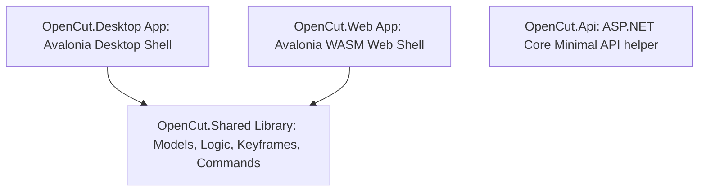

# Product Requirements Document (PRD): OpenCut (Avalonia UI & .NET 9)

## 1. Product Vision & Goals

OpenCut is a free, open-source, and privacy-first video editing suite designed as a viable alternative to CapCut. While many basic editing tools are increasingly moving behind paywalls, OpenCut provides a robust local editor where all assets, processing, and media remain on the user's local device.

### Core Objectives:
- **Privacy-First**: Keep all media processing, editing, and rendering on the client machine.
- **Cross-Platform Delivery**: Deploy native high-performance desktop apps (Windows 10/11) and web apps (WebAssembly) from a single shared C# codebase.
- **Aesthetic Excellence**: Stupendous modern UI design built on unified theme tokens matching premium creator tools.
- **AI-Augmented Workflow**: Integrate local and remote generative AI tools (video/image generation, transcription) using a Bring-Your-Own-Key (BYOK) model.

---

## 2. System Architecture

OpenCut is structured as a .NET 9 monorepo solution utilizing **Avalonia UI** for the frontend, split into decoupled layers to separate logic from presentation:

1. **`OpenCut` (Shared Project)**: Holds core data models, timeline element structures, keyframe interpolation systems, and command-driven timeline mutation logic. 
2. **`OpenCut.Desktop`**: Target platform `net9.0`. Win32 native wrapper, handles GPU acceleration, local file-system operations, and high-fidelity video rendering.
3. **`OpenCut.Web`**: Target platform `net8.0-browser` WASM. Targets modern web browsers with sandboxed WASM.
4. **`OpenCut.Api`**: Target platform `net9.0`. Light micro-backend to support external services, proxying AI requests, or providing diagnostics.

---

## 3. 95% Rewrite & Migration Strategy

To transition from the legacy TypeScript/React/Rust codebase to C#/.NET 9/Avalonia UI, the project follows three major transformation pillars:

### 3.1. UI Layer Migration (React/Tailwind → Avalonia XAML)
- **Visuals**: Convert HTML/CSS structures (flexboxes, grids) to Avalonia XAML controls (`Grid`, `StackPanel`, `Canvas`).
- **Styling**: Map Tailwind design classes to `LumosTheme` static constants for colors, spacing, corner radii, and weights.
- **Timeline Canvas**: Implement a custom timeline track canvas in Avalonia to handle smooth rendering of thousands of frame rectangles, zoom scales, snapping indicators, and track headers.

### 3.2. State & Logic Migration (TypeScript/Zustand → C# MVVM)
- **State management**: Replace Zustand stores with central ViewModels (`MainViewModel`, `TimelineViewModel`, `PlaybackViewModel`) implementing `ObservableRecipient` from CommunityToolkit.Mvvm.
- **Timeline Mutations**: Replace unstructured typescript functions with a C# Command pattern (`AddElementCommand`, `TrimElementCommand`, `SplitElementCommand`) providing transactional history (Undo/Redo).
- **Keyframe Interpolation**: Port linear and bezier interpolation logic from JS to C# floating-point math, allowing keyframe-based property resolving at time `t`.

### 3.3. GPU & Shader Integration (Rust wgpu → .NET wgpu-sharp / Silk.NET)
- **Shader Portability**: Keep the WGSL shader code (`.wgsl` files) 100% intact.
- **Orchestration**: Port GPU setup, texture binding, and pass rendering from Rust to C# using a WebGPU wrapper (.NET wgpu-sharp or Silk.NET.WebGPU), making the rendering pipeline cross-platform for both desktop and WebAssembly.

---

## 4. Core Feature Requirements

### 4.1. Command-Driven Timeline Engine
All modifications to the timeline (cuts, trims, shifts, deletes) must run through command objects to guarantee full undo/redo capabilities, easy automation, and external manipulation via MCP.
- **Track Types Supported**: Video, Audio, Text, Image.
- **Timeline Operations**: 
  - Add/Remove element.
  - Split track at playhead.
  - Trim element start/end.
  - Slide/reposition element on track.
  - Layer ordering.

### 4.2. Keyframe Animation Subsystem
Allows element parameters (e.g. position, scale, opacity, color) to be animated dynamically over time.
- **Registry**: Declares which properties are animatable.
- **Easing Modes**: Linear, EaseInOut, Elastic, Bounce.
- **Real-Time Resolver**: Computes the property value at any local timestamp `t` for rendering.

### 4.3. GPU Effects & Transitions
A modular rendering pipeline applying image/video transformations using shaders.
- **Effects Chain**: Linear stacking of single-pass or multi-pass shaders (e.g. blur, contrast, chroma key).
- **WGSL Shader Registry**: Compile and apply hardware-accelerated effects on the rendering viewport.
- **Transitions**: Alpha-mattes, slide, dissolve, cross-fades.

### 4.4. AI Generative & Automation Panel
- **Generative Media**: Interfaces with Kling, Seedance, Fal.ai to generate video/images directly onto the timeline tracks.
- **Transcription**: Automated speech-to-text generating aligned subtitles/text elements on the timeline.
- **Local Proxying**: Using the `OpenCut.Api` backend to securely manage API keys.

---

## 5. UI & Design System

OpenCut UI aligns with the **LumosTheme** constants for a state-of-the-art dark-mode aesthetic:
- **Aesthetic**: Sleek dark mode (background `#0f0f0f`), high-contrast accenting, and clear spacing layout.
- **Responsive Layout**: Sidebar asset browser, centered preview player, right-hand property inspectors, and bottom timeline track controls.
- **Interactive States**: Smooth micro-animations on button hover, dragging indicators for tracks, and snapping guidelines.
